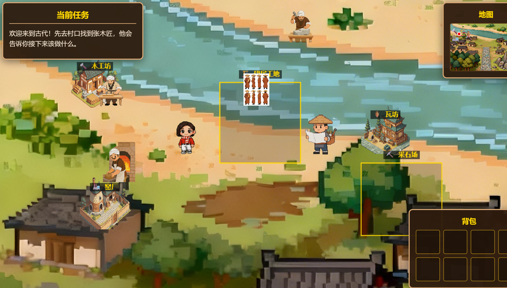
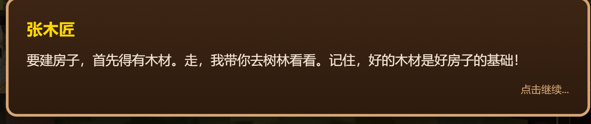
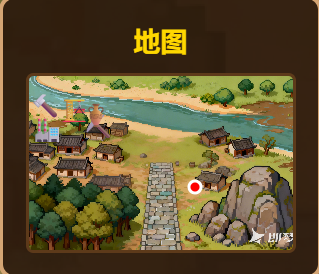
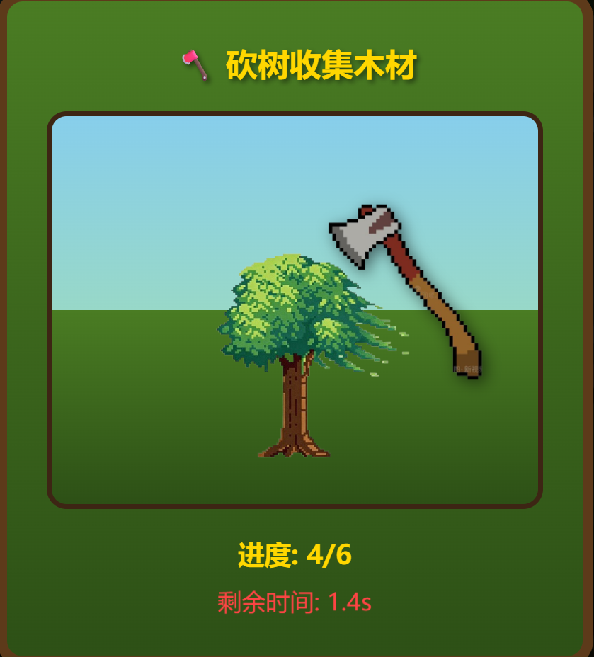
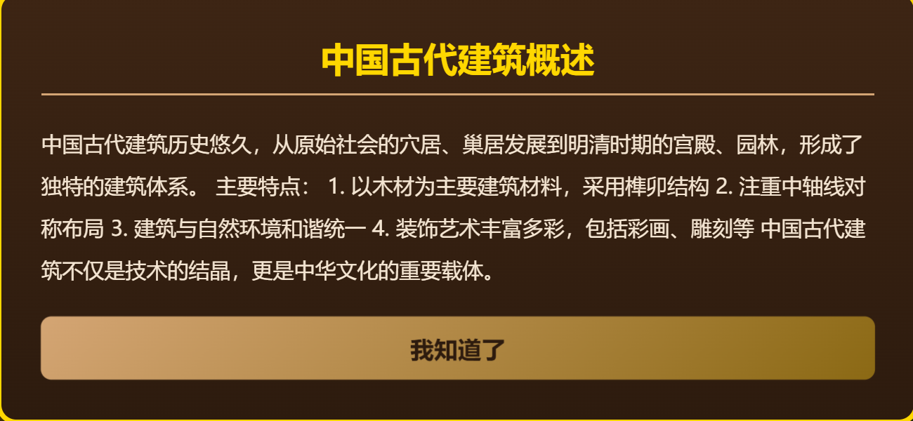

# Mini-Game-of-Ancient-Chinese-Architecture

一款以中国古代建筑为主题的网页小游戏，玩家可以体验传统建筑工艺的魅力。

## 🎮 游戏特色

- **瓦片小游戏**：通过拖拽不同形状的瓦片，完成建筑屋顶的铺设
- **资源采集系统**：在森林中采集木材，在采石场采集石材
- **NPC互动**：与工匠、窑工、瓦匠等NPC对话，获取任务和帮助
- **建造系统**：使用采集的资源建造房屋
- **地图探索**：在游戏世界中自由探索，发现各种资源和任务地点

## 🛠️ 技术栈

- **游戏引擎**：Phaser 3
- **语言**：HTML5 / CSS3 / JavaScript
- **服务器**：Python HTTP Server

## 📁 项目结构

```
├── html/                    # 游戏主目录
│   ├── index.html           # 游戏入口
│   ├── js/                  # JavaScript代码
│   │   ├── main.js          # 游戏主入口
│   │   ├── config.js        # 游戏配置
│   │   ├── scenes/          # 场景管理
│   │   │   ├── BootScene.js # 启动场景
│   │   │   └── GameScene.js # 游戏主场景
│   │   ├── entities/        # 实体类
│   │   │   ├── Player.js    # 玩家类
│   │   │   └── NPC.js       # NPC类
│   │   └── utils/           # 工具类
│   │       ├── Backpack.js       # 背包系统
│   │       └── DialogueManager.js # 对话管理
│   └── assets/              # 游戏资源
│       ├── characters/      # 角色精灵
│       ├── buildings/       # 建筑精灵
│       ├── map/             # 地图资源
│       └── ...              # 其他资源
├── images/                  # 项目图片
├── rules/                   # 项目规则文档
└── README.md                # 项目说明
```

## 🚀 快速开始

### 安装与运行

1. **克隆仓库**
```bash
git clone https://github.com/huasheng6543/Mini-Game-of-Ancient-Chinese-Architecture.git
cd Mini-Game-of-Ancient-Chinese-Architecture
```

2. **启动服务器**
```bash
cd html
python -m http.server 8000
```

3. **访问游戏**
在浏览器中打开 `http://localhost:8000`

### 游戏操作

- **鼠标点击**：点击地图任意位置移动角色
- **鼠标点击NPC**：与NPC对话、接取任务
- **鼠标点击采集区域**：采集资源、开始小游戏
- **鼠标拖拽**：在瓦片小游戏中拖拽瓦片

## 📷 游戏截图

### 开始界面


### 游戏主页面


### 对话框功能


### 小地图功能


### 小游戏功能


### 知识框功能


## 📄 许可证

MIT License

## 🤝 贡献

欢迎提交 Issue 和 Pull Request！

## 📧 联系方式

如有问题或建议，欢迎联系开发者。